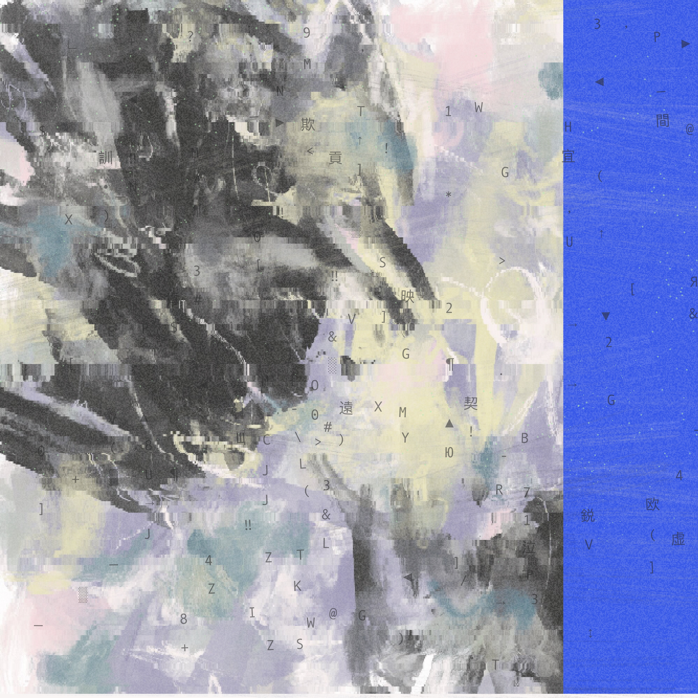
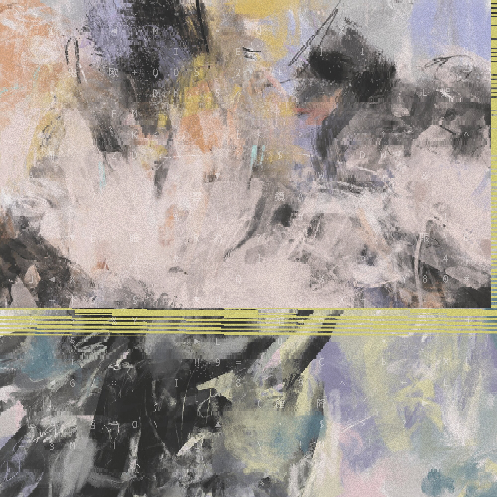

# Generative-Pointillism
Image distortion exploration as a method for composition reconstruction.


## What is it

It is an algorithmic work of digital art. The script distorts a source image, generating a randomized recomposition.

Made with [`canvas-sketch`](https://github.com/mattdesl/canvas-sketch), [`canvas-sketch-util`](https://github.com/mattdesl/canvas-sketch-util), and pure JavaScript; from the pre-AI era. Works in your browser. The script is quite heavy — open the browser inspector to monitor output generation progress. Works best in Google Chrome.

<div style="display: flex; gap: 20px;">


</div>


## How to run

Download and install fonts:

 - https://fonts.google.com/specimen/Rubik
 - https://en.wikipedia.org/wiki/Andalé_Mono (comes bundled with MacOS)

Then run in Terminal:

```sh
npm install canvas-sketch-cli --global
npm install canvas-sketch-util --save
canvas-sketch pointfields-v5.1.6.js --open
```

Open http://localhost:9966/ in the browser.


## How to use

- `Cmd+R` Refresh the browser window to generate a new output.
- `Cmd+S` Save the output as a .PNG image.

---

Gradually developed over the 2023–2024 timespan and used in digital artworks released under a pseudonymous moniker. All rights reserved.
